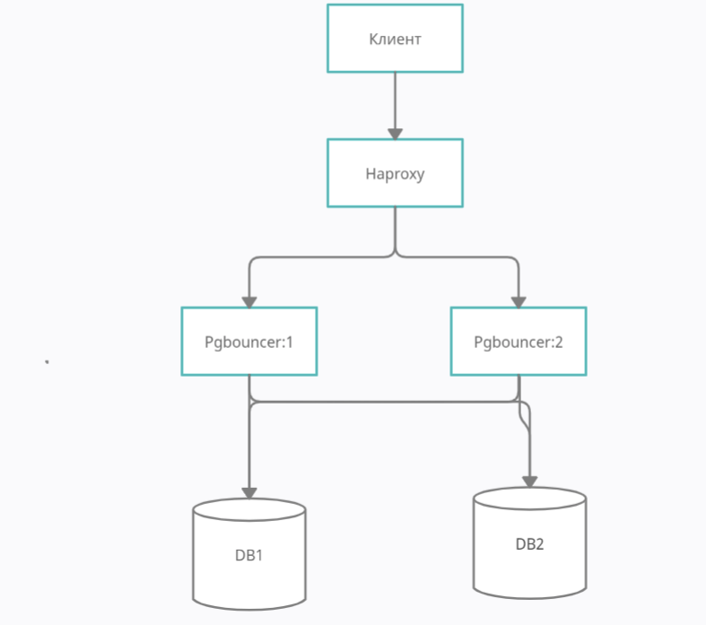

# Запуск pgbouncer
Настройки описаны в файле pgbouncer.ini
```bash
pgbouncer -d -R pgbouncer.ini
```
# Рестарт postgresql
Отредактировать настройки Postgres и перезапустить.
max_connection по умолчанию 100. Для тестов можно установить 1000.
```bash
/etc/init.d/postgresql restart
```
# Нагрузочное тестирование
Для тестирования будем использовать стандартную утилиту pgbench.
Сначала создадим базу и залним ее командой:
```bash
pgbench -h localhost -p 5432 -U postgres -i -s 10 benchmark
````
далее запускаем тесты
```bash
pgbench -h localhost -p 5432 -U postgres -c 300 -j 2 -P 10 -T 60 benchmark
```
Теперь запустим этот тест через pgbouncer указав порт на котором он запущен.
За это отвечают настройки в `pgbouncer.ini` `listen_port = 6432
 listen_addr = localhost`. Так же в настройках же необходимо прописать
бд в секции `[databases]` `benchmark = host=localhost port=5432 dbname=benchmark`.
Прописать креденшелы для доступе к бд в файле `userlist.txt` `"postgres" "postgres"`
```bash
pgbench -h localhost -p 6432 -U postgres -c 300 -j 2 -P 10 -T 60 benchmark
```
Во время выполнения нагрузочного скрипта можно смотреть активных клиентов
```
select * FROM pg_stat_activity; #просмотр активных клиентов
```

```
# удаление клиентов
SELECT pg_terminate_backend(pg_stat_activity.pid)
  FROM pg_stat_activity
  WHERE pg_stat_activity.datname = 'benchmark'
```
# Масштабирование pgbouncer


Для горизонтального масштабирования используем haproxy.
Настройки описаны в `haproxy.cfg`. Запустить compose
```bash
docker-compose up
```
test
```bash
pgbench -h localhost -p 5433 -U postgres -c 300 -j 2 -P 10 -T 60 benchmark
```